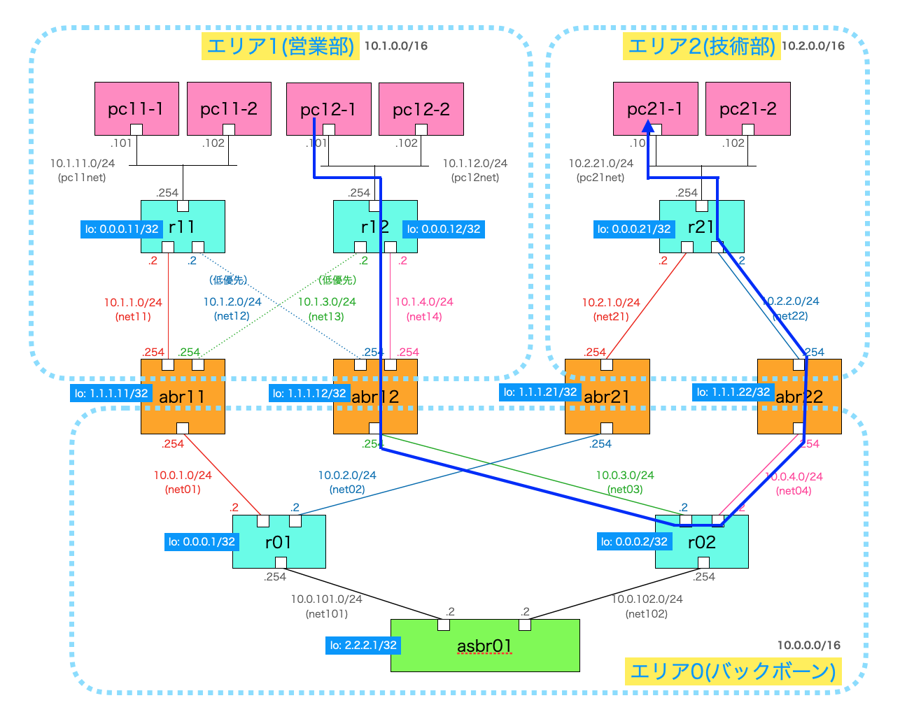
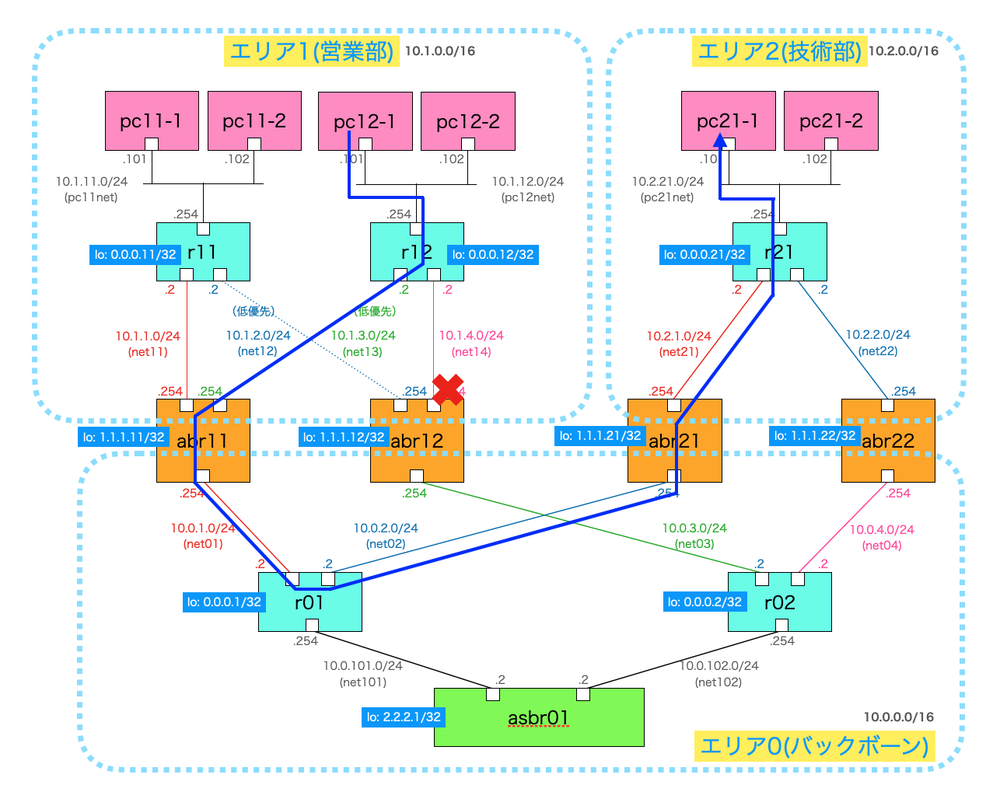

# OSPF練習 その2（マルチエリアと冗長化）

## 概要
Linux環境内で複数のPCとルータをdockerコンテナで作成し、OSPFでルーティング情報をOSPFで動的に作成するデモ環境。<br>
ルータはLinux上で動作するFRR（コンテナ版）を使用する。

## ネットワーク構成


- 数百人規模の企業ネットワークを想定し、部署ごとにOSPFのエリアを分ける（営業部⇒エリア1、技術部⇒エリア2）
- エリア1とエリア2はバックボーン(エリア0)でつなげる
- それぞれの中継ルータは単一障害点とならないよう冗長化
- 営業部の斜めの経路は低優先ルート（コスト値=500を設定）
- AS間通信用にASBRも設置（今回は使わない）

### 各PCの設定

- PCを接続するルータをデフォルトGWとして設定
```
route add default gw 10.1.11.254
```

### 各ルータの設定

- ループバックIFにユニークなIPアドレスを設定（今回は使わないが設定するのが一般的）
- OSPFの広告対象（ルータに接続しているネットワークアドレスとエリア番号）を設定
```
# 以下はabr11の設定内容
router ospf
 network 10.1.1.0/24 area 1
 network 10.1.3.0/24 area 1
 network 10.0.1.0/24 area 0
 router-info area
```

## 起動方法
```
docker compose up --build
```

## 解説
起動して数分後、OSPFで経路が広告される。<br>
例として、技術部のr21ルータでは以下のルートが作成される。
```
$ docker compose exec -it r21 /bin/sh
/ # vtysh

Hello, this is FRRouting (version 8.4.1_git).
Copyright 1996-2005 Kunihiro Ishiguro, et al.

r21# show ip route
Codes: K - kernel route, C - connected, S - static, R - RIP,
       O - OSPF, I - IS-IS, B - BGP, E - EIGRP, N - NHRP,
       T - Table, v - VNC, V - VNC-Direct, A - Babel, F - PBR,
       f - OpenFabric,
       > - selected route, * - FIB route, q - queued, r - rejected, b - backup
       t - trapped, o - offload failure

K>* 0.0.0.0/0 [0/0] via 10.2.1.1, eth0, 00:00:58
O>* 10.0.1.0/24 [110/30] via 10.2.1.254, eth0, weight 1, 00:00:04
O>* 10.0.2.0/24 [110/20] via 10.2.1.254, eth0, weight 1, 00:00:08
O>* 10.0.3.0/24 [110/30] via 10.2.2.254, eth1, weight 1, 00:00:08
O>* 10.0.4.0/24 [110/20] via 10.2.2.254, eth1, weight 1, 00:00:08
O>* 10.0.101.0/24 [110/30] via 10.2.1.254, eth0, weight 1, 00:00:04
O>* 10.0.102.0/24 [110/30] via 10.2.2.254, eth1, weight 1, 00:00:08
O>* 10.1.1.0/24 [110/40] via 10.2.1.254, eth0, weight 1, 00:00:04
O>* 10.1.2.0/24 [110/530] via 10.2.2.254, eth1, weight 1, 00:00:08
O>* 10.1.3.0/24 [110/530] via 10.2.1.254, eth0, weight 1, 00:00:04
O>* 10.1.4.0/24 [110/40] via 10.2.2.254, eth1, weight 1, 00:00:08
O>* 10.1.11.0/24 [110/50] via 10.2.1.254, eth0, weight 1, 00:00:04
O>* 10.1.12.0/24 [110/50] via 10.2.2.254, eth1, weight 1, 00:00:08
O   10.2.1.0/24 [110/10] is directly connected, eth0, weight 1, 00:00:58
C>* 10.2.1.0/24 is directly connected, eth0, 00:00:58
O   10.2.2.0/24 [110/10] is directly connected, eth1, weight 1, 00:00:58
C>* 10.2.2.0/24 is directly connected, eth1, 00:00:58
O   10.2.21.0/24 [110/10] is directly connected, eth2, weight 1, 00:00:58
C>* 10.2.21.0/24 is directly connected, eth2, 00:00:58
```

pc12-1⇒pc21-1の通信ルートは以下である。


pc12-1上でtracerouteを実行すると、図の通りにルーティングされることがわかる。
```
$ docker compose exec -it pc12-1 /bin/sh
/ # traceroute 10.2.21.101
traceroute to 10.2.21.101 (10.2.21.101), 30 hops max, 46 byte packets
 1  r12.ospf02_pc12net (10.1.12.254)  0.010 ms  0.003 ms  0.004 ms
 2  10.1.4.254 (10.1.4.254)  0.003 ms  0.006 ms  0.004 ms
 3  10.0.3.2 (10.0.3.2)  0.005 ms  0.004 ms  0.003 ms
 4  10.0.4.254 (10.0.4.254)  0.004 ms  0.005 ms  0.003 ms
 5  10.2.2.2 (10.2.2.2)  0.004 ms  0.003 ms  0.003 ms
 6  10.2.21.101 (10.2.21.101)  0.003 ms  0.003 ms  0.002 ms
```

経路切り替えの実験として、経路上のabr12の10.1.4.0のインタフェースをシャットダウンさせる。
```
$ docker compose exec -it abr12 /bin/sh
/ # vtysh

Hello, this is FRRouting (version 8.4.1_git).
Copyright 1996-2005 Kunihiro Ishiguro, et al.

abr12# conf t
abr12(config)# interface eth2
abr12(config-if)# shutdown
abr12(config-if)# exit
```

pc12-1⇒pc21-1の通信ルートが以下に切り替わる。


pc12-1上でtracerouteを実行すると、図の通りにルーティングが変更されたことがわかる。
```Shell
$ docker compose exec -it pc12-1 /bin/sh
/ # traceroute 10.2.21.101
traceroute to 10.2.21.101 (10.2.21.101), 30 hops max, 46 byte packets
 1  r12.ospf02_pc12net (10.1.12.254)  0.008 ms  0.003 ms  0.003 ms
 2  10.1.3.254 (10.1.3.254)  0.003 ms  0.006 ms  0.004 ms
 3  10.0.1.2 (10.0.1.2)  0.004 ms  0.005 ms  0.005 ms
 4  10.0.2.254 (10.0.2.254)  0.005 ms  0.004 ms  0.003 ms
 5  10.2.1.2 (10.2.1.2)  0.003 ms  0.004 ms  0.002 ms
 6  10.2.21.101 (10.2.21.101)  0.002 ms  0.003 ms  0.003 ms
```

技術部のr21ルータのルーティングテーブルも変化する。<br>
（10.1.12.0/24宛てのルートが変わっていることを確認）
```
$ docker compose exec -it r21 /bin/sh
/ # vtysh

Hello, this is FRRouting (version 8.4.1_git).
Copyright 1996-2005 Kunihiro Ishiguro, et al.

r21# show ip route
Codes: K - kernel route, C - connected, S - static, R - RIP,
       O - OSPF, I - IS-IS, B - BGP, E - EIGRP, N - NHRP,
       T - Table, v - VNC, V - VNC-Direct, A - Babel, F - PBR,
       f - OpenFabric,
       > - selected route, * - FIB route, q - queued, r - rejected, b - backup
       t - trapped, o - offload failure

K>* 0.0.0.0/0 [0/0] via 10.2.1.1, eth0, 00:05:57
O>* 10.0.1.0/24 [110/30] via 10.2.1.254, eth0, weight 1, 00:05:03
O>* 10.0.2.0/24 [110/20] via 10.2.1.254, eth0, weight 1, 00:05:07
O>* 10.0.3.0/24 [110/30] via 10.2.2.254, eth1, weight 1, 00:05:07
O>* 10.0.4.0/24 [110/20] via 10.2.2.254, eth1, weight 1, 00:05:07
O>* 10.0.101.0/24 [110/30] via 10.2.1.254, eth0, weight 1, 00:05:03
O>* 10.0.102.0/24 [110/30] via 10.2.2.254, eth1, weight 1, 00:05:07
O>* 10.1.1.0/24 [110/40] via 10.2.1.254, eth0, weight 1, 00:05:03
O>* 10.1.2.0/24 [110/530] via 10.2.2.254, eth1, weight 1, 00:05:07
O>* 10.1.3.0/24 [110/530] via 10.2.1.254, eth0, weight 1, 00:05:03
O>* 10.1.4.0/24 [110/540] via 10.2.1.254, eth0, weight 1, 00:01:25
O>* 10.1.11.0/24 [110/50] via 10.2.1.254, eth0, weight 1, 00:05:03
O>* 10.1.12.0/24 [110/540] via 10.2.1.254, eth0, weight 1, 00:01:25
O   10.2.1.0/24 [110/10] is directly connected, eth0, weight 1, 00:05:57
C>* 10.2.1.0/24 is directly connected, eth0, 00:05:57
O   10.2.2.0/24 [110/10] is directly connected, eth1, weight 1, 00:05:57
C>* 10.2.2.0/24 is directly connected, eth1, 00:05:57
O   10.2.21.0/24 [110/10] is directly connected, eth2, weight 1, 00:05:57
C>* 10.2.21.0/24 is directly connected, eth2, 00:05:57
```

## 後片付け

コンテナを起動したターミナルをCtrl+Cで止め、以下を実行する。

```
docker compose up --build
```

## ルータの設定内容

### r11
```
frr version 8.4.1_git
frr defaults traditional
hostname r11
no ipv6 forwarding
service integrated-vtysh-config
!
interface lo
 ip address 0.0.0.11/32
!
router ospf
 network 10.1.11.0/24 area 1
 network 10.1.1.0/24 area 1
 network 10.1.2.0/24 area 1
 router-info area
!
line vty
!
interface eth1
 ip ospf cost 500
!
```

### abr11
```
frr version 8.4.1_git
frr defaults traditional
hostname abr21
no ipv6 forwarding
service integrated-vtysh-config
!
interface lo
 ip address 1.1.1.21/32
!
router ospf
 network 10.2.1.0/24 area 2
 network 10.0.2.0/24 area 0
 router-info area
!
line vty
!
```

### asbr01
```
frr version 8.4.1_git
frr defaults traditional
hostname asbr01
no ipv6 forwarding
service integrated-vtysh-config
!
interface lo
 ip address 2.2.2.1/32
!
router ospf
 network 10.0.101.0/24 area 0
 network 10.0.102.0/24 area 0
 router-info area
!
line vty
!
```