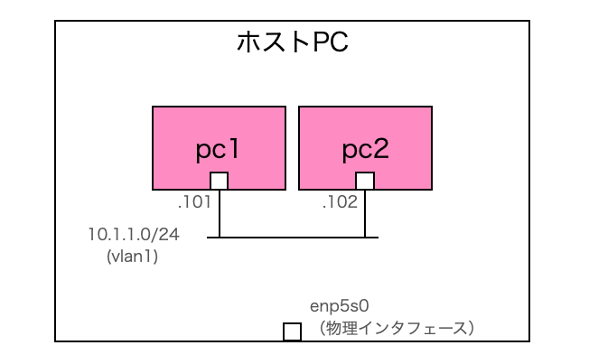

# 1. Dockerコンテナで擬似PCをデプロイする

## 概要
最初の演習として、擬似PCをDockerコンテナで作成し、擬似PCの中を覗いてみます。
 
<br>

## ネットワーク構成
まだこの段階ではネットワークは意識しません。
 
 下図の通り、pc1-1という名前のDockerコンテナをVM1上にデプロイします。このpc1-1を擬似PCとして今後も使っていきます。
 

 
<br>

## 動作確認
解説は後回しにして、先に擬似PCのデプロイを行ってみます。
 
simple01ディレクトリ内へ移動し、docker compose upコマンドを実行します。以下の結果が出力されれば、VM1内に擬似PCがデプロイされています。
```Shell
(VM1)$ cd simple01
(VM1)$ docker compose up
```

```
（実行結果）

[+] Running 2/2
 ✔ Network simple01_default  Created
 ✔ Container pc1-1           Created
 Attaching to pc1-1
```

デプロイしたコンテナ情報を見てみます。
```
(VM1)$ docker ps
```

```
（実行結果）

CONTAINER ID   IMAGE           COMMAND     CREATED          STATUS          PORTS     NAMES
9b65cb413fb7   alpine:latest   "/bin/sh"   17 minutes ago   Up 17 minutes             pc1-1
```

別のターミナルを開き、以下のようにdocker execコマンドを実行すると擬似PCに接続できます。
```Shell
(VM1)$ docker exec -it pc1-1 /bin/sh
```

「ip a」コマンドを実行すると、PCと同じように擬似PCのネットワーク情報が出力されます。
```Shell
(pc1-1)/ # ip a
```

```
（実行結果）

1: lo: <LOOPBACK,UP,LOWER_UP> mtu 65536 qdisc noqueue state UNKNOWN qlen 1000
    link/loopback 00:00:00:00:00:00 brd 00:00:00:00:00:00
    inet 127.0.0.1/8 scope host lo
       valid_lft forever preferred_lft forever
    inet6 ::1/128 scope host 
       valid_lft forever preferred_lft forever
2: eth0@if14: <BROADCAST,MULTICAST,UP,LOWER_UP,M-DOWN> mtu 1500 qdisc noqueue state UP 
    link/ether 7a:59:9e:df:c3:fd brd ff:ff:ff:ff:ff:ff
    inet 172.18.0.2/16 brd 172.18.255.255 scope global eth0
       valid_lft forever preferred_lft forever
```

終了する際は、コンテナを起動したターミナルをCtrl+Cで止め、docker compose downコマンドを実行して後片付けします。
```
(VM1)$ docker compose down
```
<br>

## 解説

今回はもっとも基本的なDockerの使い方になります。

PCを擬似したDockerコンテナに関する情報をcompose.yamlに記述して、docker compose upコマンドでcompose.yamlに定義されたコンテナを起動しました。

```YML
services:
  pc1-1:
    image: alpine:latest
    container_name: pc1-1
    hostname: pc1-1
    tty: true
    stdin_open: true
    privileged: true
```

compose.yamlのservicesセクションにコンテナの定義を記述します。
 
それぞれの設定項目の内容は以下の通りです。

| 項目 | 内容 |
|----|----|
| image | コンテナに使用するDockerイメージ。<br>alpineは軽量Linuxとしてよく使われる。|
| container_name | コンテナに付ける明示的な名前。<br>これをdocker execコマンドのコンテナ名に指定することになる。 |
| hostname | デプロイしたコンテナのホスト名に使われる。<br>また他のコンテナから名前解決する際にも使われる。|
| tty | コンテナに擬似ターミナル(TTY)を割り当てる。<br>コンテナが対話型の端末として振る舞い、コンテナが継続動作するようになる。 |
| stdin_open | 標準入力(stdin)を開いたままにする設定。<br>これにより、コンテナがユーザーの入力を受け付ける状態を維持し、対話型の操作が可能になる。|
| privileged | trueにするとコンテナに特権アクセス権を与える。<br>これにより、通常のコンテナでは制限されるカーネル昨日やデバイスアクセスが可能になる。|

「privileged: true」を設定するとセキュリティリスクが高くなります。この後の演習でルート設定などのネットワーク操作を行う際に必要になるため、「privileged: true」を設定することとします。
 
dockerコンテナのデプロイと削除は「docker compose」コマンドを使用します。

```Shell
（デプロイ）
docker compose up

（削除）
docker compose down
```
実行すると、カレントディレクトリ内のcompose.yamlを読み込んで、記述内容に沿ってDcokerコンテナをデプロイしたり削除したりします。

dockerコンテナの接続は「docker exec」コマンドを使用します。

```Shell
（コンテナへの接続）
docker exec -it pc1-1 /bin/sh
```
「-it」オプションは、「-i」で標準入力(stdin)を開いたままにし、「-t」で擬似端末(TTY)を割り当てます。これにより、コンテナ内で対話的にコマンドを実行できるようになります。

<br>
コンテナを無事に作ることができたところで、[次回の演習](./simple02/README.md)からコンテナが接続するネットワークに触れていきます。

