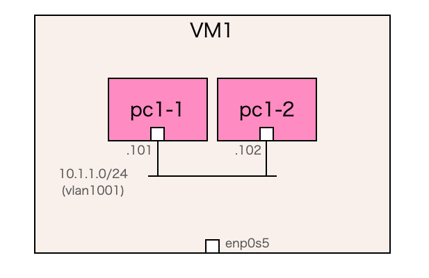

# 2. 擬似PCをネットワークに接続する

## 概要
2台の擬似PCを同じネットワークに接続し、擬似PC間でping確認を行ってみます。
 
<br>

## ネットワーク構成
下図の通り、Dockerコンテナで作成した2台の擬似PCを、他のネットワークから独立したコンテナネットワーク上で接続します。
 

 
<br>

## 動作確認
今回も解説は後回しにして、先にpingの動作確認を行ってみます。
 
VM1上のsimple02ディレクトリ内へ移動し、「up1.sh」という名前のシェルスクリプトを実行します。以下の結果が出力されれば、VM1内に擬似PC2台とネットワークがデプロイされています。

```Shell
(VM1)$ cd network-train/simple02
(VM1)$ ./up1.sh
```

```
（実行結果）

[+] Running 3/3
 ✔ Network simple02_vlan1001  Created
 ✔ Container pc1-2            Created
 ✔ Container pc1-1            Created
Attaching to pc1-1, pc1-2
```

<br>

デプロイしたコンテナ情報を見てみます。
```Shell
(VM1)$ docker ps
```

```Shell
（実行結果）

CONTAINER ID   IMAGE           COMMAND     CREATED          STATUS          PORTS     NAMES
b0b812d31336   alpine:latest   "/bin/sh"   11 minutes ago   Up 11 minutes             pc1-1
3fb5670e1a16   alpine:latest   "/bin/sh"   11 minutes ago   Up 11 minutes             pc1-2
```

<br>

コンテナのネットワーク情報も見てみます。

```Shell
(VM1)$ docker network ls
```

```Shell
（実行結果）

NETWORK ID     NAME                DRIVER    SCOPE
51da0523259e   bridge              bridge    local
a432ba3760a0   host                host      local
0bcb0c5aedd1   none                null      local
23d9b00b79e4   simple02_vlan1001   macvlan   local
```
「simple02_vlan1001」という名前のネットワークが、2台の擬似PCを接続するために新たに作成したネットワークです。
 
このネットワークの詳細情報も見てみます。

```Shell
(VM1)$ docker inspect simple02_vlan1001
```

```
（実行結果）
[
    {
        "Name": "simple02_vlan1001",
        "Id": "8d54390d00d2f850d9142ec6d7aa45f2c08a7ec14d9ad66f49269370de781c76",
        "Created": "2025-11-03T17:37:58.293416957+09:00",
        "Scope": "local",
        "Driver": "macvlan",
        "EnableIPv4": true,
        "EnableIPv6": false,
        "IPAM": {
            "Driver": "default",
            "Options": null,
            "Config": [
                {
                    "Subnet": "10.1.1.0/24",
                    "Gateway": "10.1.1.1"
                }
            ]
        },
        "Internal": false,
        "Attachable": false,
        "Ingress": false,
        "ConfigFrom": {
            "Network": ""
        },
        "ConfigOnly": false,
        "Containers": {
            "9c0259498676e54a8ae491f838233b93b84469df867fdcef46554626f4b30bff": {
                "Name": "pc1-1",
                "EndpointID": "4ce643da031892f8650ed3aff2f6bdcd53b878cd9a48d73ca66f3f0d93bf8c2c",
                "MacAddress": "02:42:ac:00:01:01",
                "IPv4Address": "10.1.1.101/24",
                "IPv6Address": ""
            },
            "a6b420d5616af17fd82f6a093c933509aeee2e7cdef03f5e6a45846c6b642c64": {
                "Name": "pc1-2",
                "EndpointID": "843f22a83e228c15b975156fbc4fa373795b8ec7aa59ad14c2c3dd9fb58eb121",
                "MacAddress": "02:42:ac:00:01:02",
                "IPv4Address": "10.1.1.102/24",
                "IPv6Address": ""
            }
        },
        "Options": {
            "parent": "enp0s5.1001"
        },
        "Labels": {
            "com.docker.compose.config-hash": "d08daf53532ee3aba8eda4ea095f20237dfc8263a3a96272a8c332fc7c0da0f5",
            "com.docker.compose.network": "vlan1001",
            "com.docker.compose.project": "simple02",
            "com.docker.compose.version": "2.40.3"
        }
    }
]
```

<br>

別のターミナルを開き、以下のようにdocker execコマンドを実行し擬似PC「pc1-1」に接続します。
```Shell
(VM1)$ docker exec -it pc1-1 /bin/sh
```

接続した擬似PC pc1-1内でpc1-2宛てにpingを実行すると応答が返ってきます。
```Shell
(pc1-1)/ # ping 10.1.1.102
PING 10.1.1.102 (10.1.1.102): 56 data bytes
64 bytes from 10.1.1.102: seq=0 ttl=64 time=2.197 ms
64 bytes from 10.1.1.102: seq=1 ttl=64 time=0.442 ms
64 bytes from 10.1.1.102: seq=2 ttl=64 time=0.099 ms
```

終了する際は、コンテナを起動したターミナルをCtrl+Cで止め、「down1.sh」という名前のシェルスクリプトを実行して後片付けします。

```Shell
(VM1)$ ./down1.sh
```

```Shell
（実行結果）
[+] Running 3/3
 ✔ Container pc1-1            Removed
 ✔ Container pc1-2            Removed
 ✔ Network simple02_vlan1001  Removed
```

<br>

## 解説

今回はDockerの機能しか使っていないため、Dockerに関する解説になります。
 
PCを擬似したDockerコンテナと、コンテナが使用するネットワークを以下のcompose.yamlに定義して、up.shスクリプト（中身はdocker compose upコマンド）で一斉起動しました。

```YML
services:
  pc1:
    image: alpine:latest
    container_name: pc1
    hostname: pc1
    tty: true
    stdin_open: true
    privileged: true
    networks:
      vlan1:
        ipv4_address: 10.1.1.101
        mac_address: "02:42:ac:00:01:01"
  pc2:
    image: alpine:latest
    container_name: pc2
    hostname: pc2
    tty: true
    stdin_open: true
    privileged: true
    networks:
      vlan1:
        ipv4_address: 10.1.1.102
        mac_address: "02:42:ac:00:01:02"

networks:
  vlan1:
    driver: macvlan
    driver_opts:
      parent: ${TRAIN_NIC}.1
    ipam:
      config:
        - subnet: 10.1.1.0/24
          gateway: 10.1.1.1
```

compose.yamlは大きく２つのセクションで構成されています。

| セクション | 内容 |
|----|----|
| services | PC2台分のコンテナの定義。<br>各コンテナで接続先のネットワーク（今回はvlan1）を指定します。 |
| networks | コンテナが接続するネットワークの定義。<br>今回はmacvlan driverで独立したコンテナネットワークを作成し、サブネットとゲートウェイも定義します。 |

macvlan driverを使用した理由は、この後の演習も含め、同一ホスト上で独立したコンテナネットワークを複数作成するため、です。
 
関連する設定はdriver_opts項目にあります。ここで **parent: ${TRAIN_NIC}.1**と設定することで、ホストPCの物理インターフェース上のサブインタフェース1に、vlan1という名前のコンテナネットワークが構築されます。

この設定でコンテナを起動すると、ホストPC上では以下のようにサブインタフェース1（以下の例ではenp0s5.1@enp0s5）が作られているのがわかります。

```Shell
$ ip addr
1: lo: <LOOPBACK,UP,LOWER_UP> mtu 65536 qdisc noqueue state UNKNOWN group default qlen 1000
    link/loopback 00:00:00:00:00:00 brd 00:00:00:00:00:00
    inet 127.0.0.1/8 scope host lo
       valid_lft forever preferred_lft forever
    inet6 ::1/128 scope host 
       valid_lft forever preferred_lft forever
2: enp0s5: <BROADCAST,MULTICAST,UP,LOWER_UP> mtu 1500 qdisc fq_codel state UP group default qlen 1000
    link/ether 00:1c:42:97:2b:40 brd ff:ff:ff:ff:ff:ff
    inet 10.211.55.6/24 metric 100 brd 10.211.55.255 scope global dynamic enp0s5
       valid_lft 1743sec preferred_lft 1743sec
    inet6 fdb2:2c26:f4e4:0:21c:42ff:fe97:2b40/64 scope global dynamic mngtmpaddr noprefixroute 
       valid_lft 2591911sec preferred_lft 604711sec
    inet6 fe80::21c:42ff:fe97:2b40/64 scope link 
       valid_lft forever preferred_lft forever
4: docker0: <NO-CARRIER,BROADCAST,MULTICAST,UP> mtu 1500 qdisc noqueue state DOWN group default 
    link/ether 02:42:d6:3a:8d:52 brd ff:ff:ff:ff:ff:ff
8: br-5f195c875120: <NO-CARRIER,BROADCAST,MULTICAST,UP> mtu 1500 qdisc noqueue state DOWN group default 
    link/ether 02:42:c8:8b:5d:f7 brd ff:ff:ff:ff:ff:ff
11: br-ebd648b5fa24: <NO-CARRIER,BROADCAST,MULTICAST,UP> mtu 1500 qdisc noqueue state DOWN group default 
    link/ether 02:42:02:fc:33:c3 brd ff:ff:ff:ff:ff:ff
13: br-171dfefd0e3f: <NO-CARRIER,BROADCAST,MULTICAST,UP> mtu 1500 qdisc noqueue state DOWN group default 
    link/ether 02:42:44:9e:ff:e1 brd ff:ff:ff:ff:ff:ff
2408: enp0s5.1@enp0s5: <BROADCAST,MULTICAST,UP,LOWER_UP> mtu 1500 qdisc noqueue state UP group default 
    link/ether 00:1c:42:97:2b:40 brd ff:ff:ff:ff:ff:ff
    inet6 fe80::21c:42ff:fe97:2b40/64 scope link 
       valid_lft forever preferred_lft forever
```

通信の経路を確認するために、2つのPC間でpingを実行してみます。
```Shell
$ docker exec -it pc1 /bin/sh
WARN[0000] The "TRAIN_NIC" variable is not set. Defaulting to a blank string. 
/ # ping 10.1.1.102
PING 10.1.1.102 (10.1.1.102): 56 data bytes
64 bytes from 10.1.1.102: seq=0 ttl=64 time=2.594 ms
64 bytes from 10.1.1.102: seq=1 ttl=64 time=0.263 ms
64 bytes from 10.1.1.102: seq=2 ttl=64 time=0.218 ms
```

pingを実行している最中に、別のターミナルでホストPCのサブインタフェース1（以下の例ではenp0s5.1）を指定してtcpdumpを行ってみます。

```Shell
$ sudo tcpdump -i enp0s5.1 -nn
tcpdump: verbose output suppressed, use -v[v]... for full protocol decode
listening on enp0s5.1, link-type EN10MB (Ethernet), snapshot length 262144 bytes
23:35:05.095951 IP 10.1.1.101 > 10.1.1.102: ICMP echo request, id 22, seq 0, length 64
23:35:05.096027 IP 10.1.1.102 > 10.1.1.101: ICMP echo reply, id 22, seq 0, length 64
23:35:06.097768 IP 10.1.1.101 > 10.1.1.102: ICMP echo request, id 22, seq 1, length 64
23:35:06.097782 IP 10.1.1.102 > 10.1.1.101: ICMP echo reply, id 22, seq 1, length 64
23:35:07.098328 IP 10.1.1.101 > 10.1.1.102: ICMP echo request, id 22, seq 2, length 64
23:35:07.098360 IP 10.1.1.102 > 10.1.1.101: ICMP echo reply, id 22, seq 2, length 64
```

コンテナ間のping通信がキャプチャできています。
 
なおこのサブインタフェース1はホストPCの物理インタフェースとは独立であるため、ホストPCの物理インタフェース（以下の例ではenp0s5）を指定してtcpdumpしてもping通信は見えません。

```Shell
parallels@ubuntu02:~$ sudo tcpdump -i enp0s5 -nn
tcpdump: verbose output suppressed, use -v[v]... for full protocol decode
listening on enp0s5, link-type EN10MB (Ethernet), snapshot length 262144 bytes
```
<br>
最もシンプルなネットワークが構築できました。次回の演習では2台のPC間にルータを挟んでみます。

