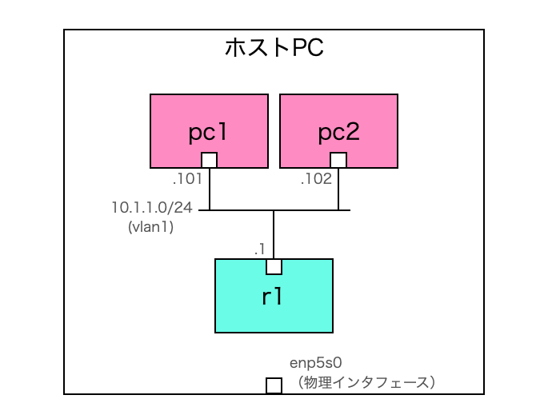

# 2. 仮想ルータを挟んでみる

## 概要
前回作成した2台のPC（それぞれDockerコンテナ）間に、Dockerコンテナで作成した仮想ルータを挟んでみます。
<br>

## ネットワーク構成
2台の擬似PCと同じネットワーク上に、仮想ルータr1を接続します。
 

 
<br>

## 動作確認
以下を実行し、擬似PCと仮想ルータを一斉起動させます。
```Shell
cd simple02
./up.sh
```

別のターミナルを開き、pc1のコンテナに入ってpingを実行します。
```Shell
docker exec -it pc1 /bin/sh
```

仮想ルータのインタフェース宛てにpingを実行すると応答が返ってきます。
```Shell
/ # ping 10.1.1.1
PING 10.1.1.1 (10.1.1.1): 56 data bytes
64 bytes from 10.1.1.1: seq=0 ttl=64 time=1.074 ms
64 bytes from 10.1.1.1: seq=1 ttl=64 time=0.258 ms
64 bytes from 10.1.1.1: seq=2 ttl=64 time=0.167 ms
```

続いて、仮想ルータのコンテナに入り、ルータのインタフェースを確認してみます。
```Shell
docker exec -it r1 /bin/sh
```
「vtysh」コマンドを実行してコマンドラインインタフェースを起動し、「show interface」コマンドを実行すると仮想ルータのインタフェース情報を確認できます。
```
/ # vtysh

Hello, this is FRRouting (version 8.4.1_git).
Copyright 1996-2005 Kunihiro Ishiguro, et al.

r1# show interface 
Interface eth0 is up, line protocol is up
  Link ups:       0    last: (never)
  Link downs:     0    last: (never)
  vrf: default
  index 2451 metric 0 mtu 1500 speed 4294967295 
  flags: <UP,BROADCAST,RUNNING,MULTICAST>
  Type: Ethernet
  HWaddr: 02:42:ac:00:01:11
  inet 10.1.1.1/24
  Interface Type macvlan
  Interface Slave Type None
  protodown: off 
  Parent ifindex: 2447
Interface lo is up, line protocol is up
  Link ups:       0    last: (never)
  Link downs:     0    last: (never)
  vrf: default
  index 1 metric 0 mtu 65536 speed 0 
  flags: <UP,LOOPBACK,RUNNING>
  Type: Loopback
  Interface Type Other
  Interface Slave Type None
  protodown: off 
r1# exit
/ # 
```


終了する際は、コンテナを起動したターミナルをCtrl+Cで止め、以下を実行して後片付けします。
```
./down.sh
```
<br>

## 解説

FRRouting（FRR）という仮想ルータを環境に追加しました。
FRRはLinux環境で動作するオープンソースのソフトウェアルータで、BGPやOSPFなどの主要なルーティングプロトコルが実装されています。

今回は以下のcompose.yamlを作成して、FRRをDockerコンテナとして起動させています。

```YML
services:
  pc1:
    image: alpine:latest
    container_name: pc1
    hostname: pc1
    tty: true
    stdin_open: true
    privileged: true
    networks:
      vlan1:
        ipv4_address: 10.1.1.101
        mac_address: "02:42:ac:00:01:01"
    command:
      - /bin/sh
      - -c
      - |
        ip route del default via 10.1.1.253
        ip route add default via 10.1.1.1
        tail -f /dev/null
    depends_on:
      - "r1"
  pc2:
    image: alpine:latest
    container_name: pc2
    hostname: pc2
    tty: true
    stdin_open: true
    privileged: true
    networks:
      vlan1:
        ipv4_address: 10.1.1.102
        mac_address: "02:42:ac:00:01:02"
    command:
      - /bin/sh
      - -c
      - |
        ip route del default via 10.1.1.253
        ip route add default via 10.1.1.1
        tail -f /dev/null
    depends_on:
      - "r1"
  r1:
    image: frrouting/frr:v8.4.1
    container_name: r1
    hostname: r1
    privileged: true
    volumes:
      - ./conf/daemons:/etc/frr/daemons:ro
      - ./conf/vtysh.conf:/etc/frr/vtysh.conf:ro
      - ./conf/r1_frr.conf:/etc/frr/frr.conf:ro
    networks:
      vlan1:
        ipv4_address: 10.1.1.1
        mac_address: "02:42:ac:00:01:11"

networks:
  vlan1:
    driver: macvlan
    driver_opts:
      parent: ${TRAIN_NIC}.1
    ipam:
      config:
        - subnet: 10.1.1.0/24
          gateway: 10.1.1.253
```

早くもcompose.yamlが巨大化してしまいましたが、順番に少しずつ見ていきたいと思います。
 
```
networks:
  vlan1:
    driver: macvlan
    driver_opts:
      parent: ${TRAIN_NIC}.1
    ipam:
      config:
        - subnet: 10.1.1.0/24
          gateway: 10.1.1.253
```
まずネットワークのgatewayを、使用しないIPアドレス（10.1.1.253）に変更しました。前回設定していたIPアドレス（10.1.1.1）をFRRに設定したいため、コンテナネットワークにデフォルトで設定されるゲートウェイアドレスに使用しないIPアドレスを設定しました。

```
services:
  pc1:

    command:
      - /bin/sh
      - -c
      - |
        ip route del default via 10.1.1.253
        ip route add default via 10.1.1.1
        tail -f /dev/null
```
これに関連して、擬似PCのデフォルトゲートウェイ設定も、起動時にip routeコマンドで変更しなおしています。

```
  r1:
    image: frrouting/frr:v8.4.1
    container_name: r1
    hostname: r1
    privileged: true
    volumes:
      - ./conf/daemons:/etc/frr/daemons:ro
      - ./conf/vtysh.conf:/etc/frr/vtysh.conf:ro
      - ./conf/r1_frr.conf:/etc/frr/frr.conf:ro
    networks:
      vlan1:
        ipv4_address: 10.1.1.1
        mac_address: "02:42:ac:00:01:11"
```
仮想ルータのFRRは上記の定義で起動しています。
 
FRR起動時に3つのファイル「daemons」「vtysh.conf」「frr.conf」が必要ですが、ホストPC側で用意したファイルをマウントして読み込ませています。

先ほどの動作確認の通り、FRRはvtyshというコマンドラインインタフェースを起動することで、Ciscoルータにあるような各種showコマンドを実行できるようになります。
```
/ # vtysh

Hello, this is FRRouting (version 8.4.1_git).
Copyright 1996-2005 Kunihiro Ishiguro, et al.

r1# show running-config 
Building configuration...

Current configuration:
!
frr version 8.4.1_git
frr defaults traditional
hostname r1
no ipv6 forwarding
service integrated-vtysh-config
!
end
```

<br>
次回はFRRを経由して擬似PCが外部NWへ通信できるようにしてみます。