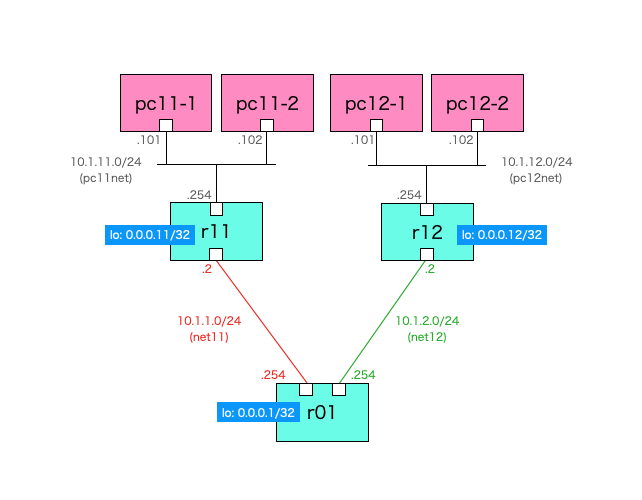
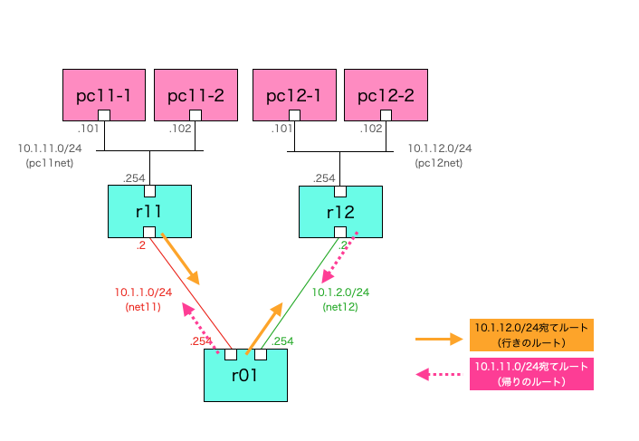

# スタティックルート練習

## 概要
スタティックルート設定を追加することでEnd-End間の通信を成功させるデモ。<br>
ルータはLinux上で動作するFRR（コンテナ版）を使用する。

## ネットワーク構成


- PCとルータは図の通りに結線とIPアドレスを設定済み。
- 各PCは接続するルータをデフォルトGWとして設定済み（例：pc11-1はr11がデフォルトGW）

各ルータにスタティックルート設定を追加し、pc11-1⇒pc12-1へのping確認を成功させる。

## 起動方法
```Shell
docker compose up --build
```

## 解説

初期状態では各ルータにスタティックルートの設定がないため、End-End間（今回はpc11-1とpc12-1の間）のping確認が失敗する。

```Shell
docker exec -it pc11-1 /bin/sh
```
```
/ # ping 10.1.12.101
PING 10.1.12.101 (10.1.12.101): 56 data bytes
・・・pingの応答が帰らない
```

ping確認を成功させるために、以下に示すルート設定を追加する。<br>
<br>
まず行きルート（echo request）については、r11ルータから先に送り出すためのルート設定が必要。<br>
具体的には以下のルート設定を追加する。<br>
- r11：10.1.12.0/24宛て（ネクストホップは10.1.1.254）
- r01：10.1.12.0/24宛て（ネクストホップは10.1.2.2）

帰りルート（echo reply）については、r12ルータから先に送り出すためのルート設定が必要。<br>
具体的には以下のルート設定を追加する。<br>
- r12：10.1.11.0/24宛て（ネクストホップは10.1.2.254）
- r01：10.1.11.0/24宛て（ネクストホップは10.1.1.2） 


<br>

上記を踏まえ、各ルータに対し以下の手順でルート設定を追加する。<br>

### r11
```Shell
docker exec -it r11 /bin/sh
```
```
/ # vtysh

Hello, this is FRRouting (version 8.4.1_git).
Copyright 1996-2005 Kunihiro Ishiguro, et al.

r11# conf t
r11(config)# ip route 10.1.12.0 255.255.255.0 10.1.1.254
r11(config)# exit
r11# 
```

### r12
```Shell
docker exec -it r12 /bin/sh
```
```
/ # vtysh

Hello, this is FRRouting (version 8.4.1_git).
Copyright 1996-2005 Kunihiro Ishiguro, et al.

r12# conf t
r12(config)# ip route 10.1.11.0 255.255.255.0 10.1.2.254
r12(config)# exit
r12#
```

### r01
```Shell
docker exec -it r01 /bin/sh
```
```
/ # vtysh

Hello, this is FRRouting (version 8.4.1_git).
Copyright 1996-2005 Kunihiro Ishiguro, et al.

r01# conf t
r01(config)# ip route 10.1.11.0 255.255.255.0 10.1.1.2
r01(config)# ip route 10.1.12.0 255.255.255.0 10.1.2.2
r01(config)# exit
r01# 
```

スタティックルートの設定後、再度End-End間（今回はpc11-1とpc12-1の間）のping確認を行うと成功する。

```Shell
docker exec -it pc11-1 /bin/sh
```
```
/ # ping 10.1.12.101
PING 10.1.12.101 (10.1.12.101): 56 data bytes
64 bytes from 10.1.12.101: seq=0 ttl=61 time=2.333 ms
64 bytes from 10.1.12.101: seq=1 ttl=61 time=0.432 ms
64 bytes from 10.1.12.101: seq=2 ttl=61 time=0.340 ms
```

## 後片付け

コンテナを起動したターミナルをCtrl+Cで止め、以下を実行する。

```Shell
docker compose up --build
```

## （補足）ルータの設定内容

### r01
```
frr version 8.4.1_git
frr defaults traditional
hostname r01
no ipv6 forwarding
service integrated-vtysh-config
!
ip route 10.1.11.0/24 10.1.1.2
ip route 10.1.12.0/24 10.1.2.2
!
end
```

### r11
```
frr version 8.4.1_git
frr defaults traditional
hostname r11
no ipv6 forwarding
service integrated-vtysh-config
!
ip route 10.1.12.0/24 10.1.1.254
!
end
```

### r12
```
frr version 8.4.1_git
frr defaults traditional
hostname r12
no ipv6 forwarding
service integrated-vtysh-config
!
ip route 10.1.11.0/24 10.1.2.254
!
end
```