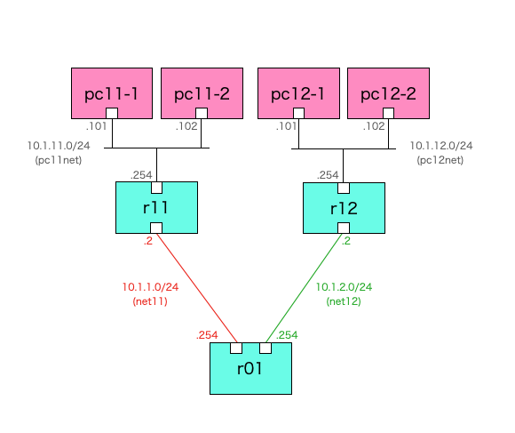

# スタティックルート練習

## 概要
・・・

## ネットワーク構成


- ・・・

### 各PCの設定

- PCを接続するルータをデフォルトGWとして設定
```
route add default gw 10.1.11.254
```

### 各ルータの設定

- ・・・
```
# 以下はabr11の設定内容
・・・
```

## 起動方法
```Shell
docker compose up --build
```

## 解説

初期状態では各ルータにスタティックルートを設定していない。<br>
そのため、pc11-1とpc12-1との間でping確認を行うと、ルート設定不足のためping応答が帰らない。

```Shell
docker exec -it pc11-1 /bin/sh
```
```
/ # ping 10.1.12.101
PING 10.1.12.101 (10.1.12.101): 56 data bytes
⇒pingの応答が帰らない
```

ping確認を成功させるために、以下に示すルート設定を追加する。<br>
<br>
まず行きルート（echo request）については、r11ルータから先に送り出すためのルート設定が必要。<br>
具体的には以下のルートが必要となる。<br>
- r11：10.1.12.0/24宛て（ネクストホップは10.1.1.254）
- r01：10.1.12.0/24宛て（ネクストホップは10.1.2.2）

帰りルート（echo reply）については、r12ルータから先に送り出すためのルート設定が必要。<br>
具体的には以下のルートが必要となる。<br>
- r12：10.1.11.0/24宛て（ネクストホップは10.1.2.254）
- r01：10.1.11.0/24宛て（ネクストホップは10.1.1.2） 

上記を踏まえ、各ルータに以下の通り上記のルート設定を追加する。<br>

### r11
```Shell
docker exec -it r11 /bin/sh
```
```
/ # vtysh

Hello, this is FRRouting (version 8.4.1_git).
Copyright 1996-2005 Kunihiro Ishiguro, et al.

r11# conf t
r11(config)# ip route 10.1.12.0 255.255.255.0 10.1.1.254
r11(config)# exit
r11# 
```

### r12
```Shell
docker exec -it r12 /bin/sh
```
```
/ # vtysh

Hello, this is FRRouting (version 8.4.1_git).
Copyright 1996-2005 Kunihiro Ishiguro, et al.

r12# conf t
r12(config)# ip route 10.1.11.0 255.255.255.0 10.1.2.254
r12(config)# exit
r12#
```

### r01
```Shell
docker exec -it r01 /bin/sh
```
```
/ # vtysh

Hello, this is FRRouting (version 8.4.1_git).
Copyright 1996-2005 Kunihiro Ishiguro, et al.

r01# conf t
r01(config)# ip route 10.1.11.0 255.255.255.0 10.1.1.2
r01(config)# ip route 10.1.12.0 255.255.255.0 10.1.2.2
r01(config)# exit
r01# 
```


## 後片付け

コンテナを起動したターミナルをCtrl+Cで止め、以下を実行する。

```Shell
docker compose up --build
```

## （補足）ルータの設定内容

### r11
```
・・・
```
